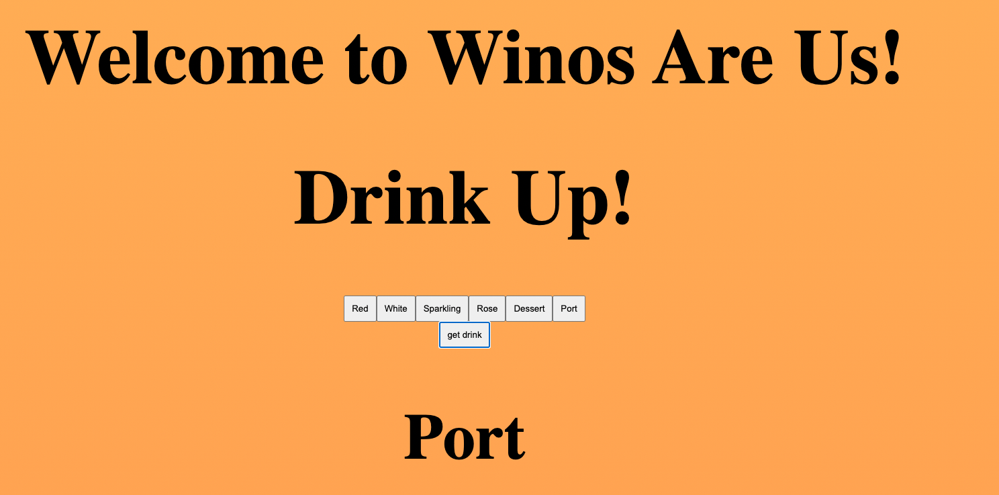

# Wine Cellar React
Developed a React application that explores map functionality, utilizing concepts such as `useState`, `fetch`, and integration with a freely available sample API.

# Features
* useState()
* Fetch
* Map()

  

# [click this link](https://www.yahoo.com)